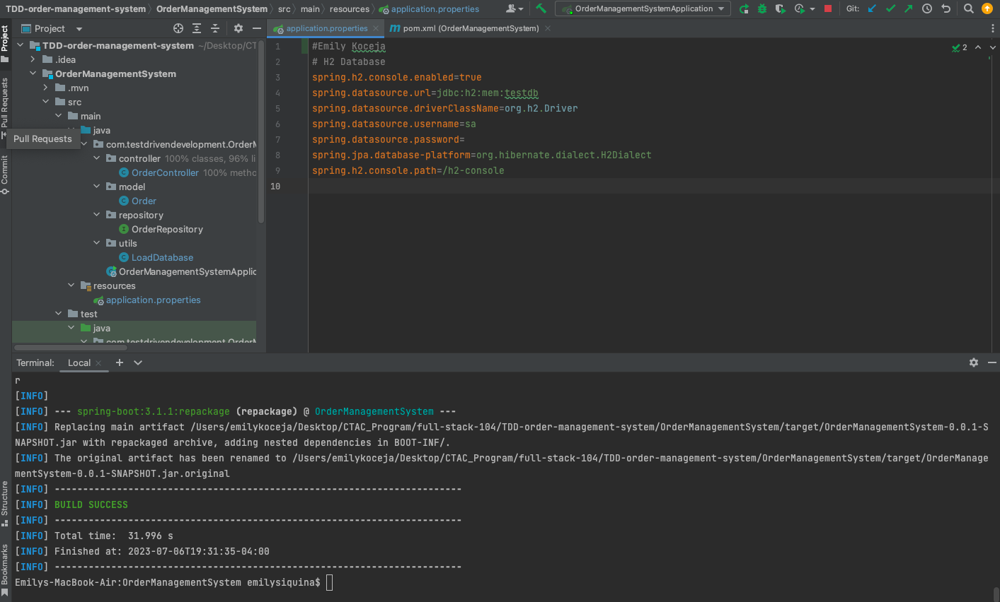
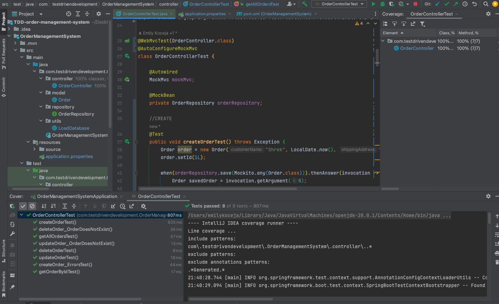
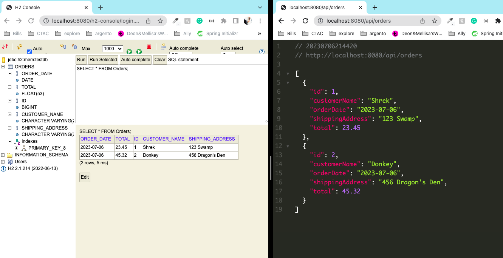

# TDD-order-management-system

Order Management System with RESTful API build following Test-Driven Development principles. It contains the basic CRUD
functionalities. This application allows the user to create a new order that must contain a name, date, address, and
total amount. The id is automatically created for each order. Users can also view the details of their order. It is also
possible to go back and update and order if mistakes were made. Lastly, the user can also delete an order by fetching it
by id.

## How it works

First and foremost, because most browsers don't inherently have the ability to send HTTP requests, you may need to
download an application like Postman, Testfully, or another DevOp tool.

There are several ways to make it work, my favorite being through the command line (refer to chart below), accessing the
H2 database, and view it as JSON. To access the H2 database, per configuration, go to localhost:/8080/h2-console and
type in the database url (can be found in the image below or the applications.properties file). You can also view the
data with JSON view if you go to localhost:8080/api/orders (example in the third image below).

These consist of HTTP verbs, a header, path to source, and an optional body message. The 4 basic HTTP verbs are: GET,
POST, PUT, and DELETE.

| REQUEST	 | FUNCTIONALITY                                                      |
|----------|--------------------------------------------------------------------|
| GET      | 	Retrieves a specific resource (ex: id) or collection of resources |
| POST     | 	Creates a new resource                                            |
| PUT	     | Updates a specific resource (ex: id)                               |
| DELETE	  | Removes a specific resource by id                                  |

### Commands to try with my code on CLI (example ids):

| ACTION	     | COMMANDS                                                                                                                                                                                |
|-------------|-----------------------------------------------------------------------------------------------------------------------------------------------------------------------------------------|
| View All	   | curl -v localhost:8080/api/orders                                                                                                                                                       |
| View By Id	 | curl -v localhost:8080/api/orders/1                                                                                                                                                     |
| Create	     | curl -X POST localhost:8080/posts -H 'Content-type:application/json' -d '{"customerName": "Muffin Man", "orderDate": "2023-07-06", "shippingAddress": "Drury Lane", "total": 40.50}'    |
| Update	     | curl -X PUT localhost:8080/posts/4 -H 'Content-type:application/json' -d '{"customerName": "Muffin-Man", "orderDate": "2023-07-06", "shippingAddress": "123 Drury Ln", "total": 50.50}' |
| Delete	     | curl -X DELETE localhost:8080/api/orders/3                                                                                                                                              |

### Testing

You can run the Repository tests and Controller tests by going to
'OrderManagementSystem/src/test/java/com/testdrivendevelopment/OrderManagementSystem/controller' or
'OrderManagementSystem/src/test/java/com/testdrivendevelopment/OrderManagementSystem/repository' to access the test
classes and run them (You can also refer to the second image below).

A very fun and helpful site to get the correct HTTP requests, [click here](https://http.cat/)!

### JAR

Run 'mvn package' on the command line and it shall start the program and execute a successful JAR file (refer to the
image below).

### Images

H2 Configuration and a successful executable JAR file! For more info on how it
works, [click here](https://docs.spring.io/spring-boot/docs/current/reference/html/getting-started.html#getting-started.first-application.executable-jar)!

Test passing with 100% coverage of the controller class!

H2 Database view that you can access at localhost:8080/h2-console, just make sure to refer to the application.properties
for the database url. I have also demonstrated the JSON view!

